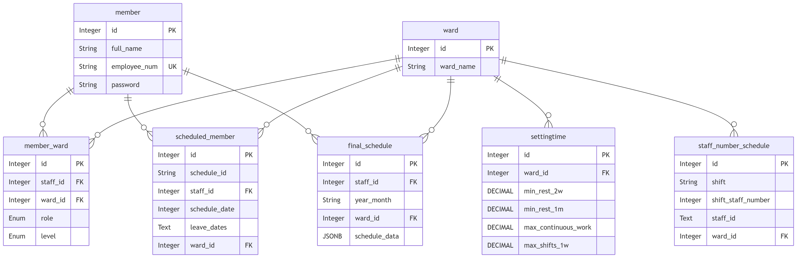
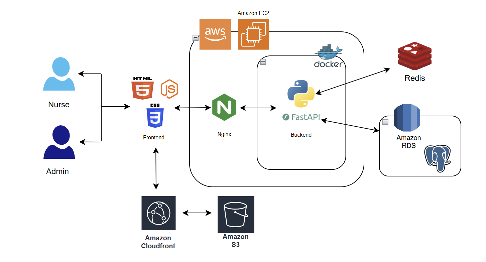

# Medi-Planner 護理排班系統

**Automated Staff Scheduling Website**

This project is designed to save time and reduce the problem of ward scheduling for nurses. By using Google OR-Tools, the system automatically calculates the best possible schedule based on your custom settings. It also includes a web interface for managers to set scheduling needs and allows staff members to pre-order their leave or preferred days off.

**Website URL**: https://nursing-scheduling.chie-web.com/

| account | password |
|---|---|
| 123 | 123 |

## ✨ Main Features

* Authentication: Secure login verification using JWT (JSON Web Token).
* Group Management:
  * Open group creation for all users.
  * Automatic Role Assignment: Group creators are designated as Admins, others as Regular Users.

* Role-Based Dashboard:
  * Admin: Access to User Management, Auto-Scheduling, Leave Requests, and Final Rosters.
  * User: Access to Leave Requests and Final Rosters.
* Staff Management: Comprehensive management of ward data and assigned medical personnel.

* Scheduling Rules: Configurable staffing requirements and shift rules for daily operations.

* Leave Requests: Online system for staff to submit pre-scheduled leave or time-off requests.

* Auto-Scheduling: One-click roster generation optimized by Google OR-Tools.

*  The result of the scheduling follows the basic rules:
   *  Balancing the total number of rest days across all staff members
   *  Enforced a mandatory 11-hour rest between shifts to prevent scheduling conflict.

## 🛠️ Techniques:

* Front-End
    * HTML, CSS,  JavaScript, Bootstrap
* Back-End
    * Web Framework: RESTful APIs with Python FastAPI
    * Database: Utilising SQLAlchemy ORM for database integration. AWS RDS PostgreSQL for data storage.
    * Authenticating users with JWT.
    * Developed Redis caching strategies to decrease database load.
    * Docker for cross-platform deployment. 
    * Implemented NGINX as a reverse proxy with SSL to ensure secure connection.
    * Saving videos on AWS S3 and distributing using CloudFront.
    * Deploy website on AWS EC2 Linux instance.
    * Construct backend code using MVC design pattern.
    * Set up CI/CD pipeline using GitHub Actions to automate the workflow.

* Third-Party Libraries
    * Choice.js
    * Day.js
    * Google OR-Tools

## ER Diagram

* Normalised database in 3NF, using connection pooling,
foreign keys and indexing strategies to enhance
database performance

## Database Schema

## ✉️ Contact:

Yun Chieh Tsai

* LinkedIn: https://www.linkedin.com/in/yun-chieh-tsai-3b0987387
* Email: amytsai56@gmail.com
* GitHub: https://github.com/yuntsai35/nursing-scheduling-system
